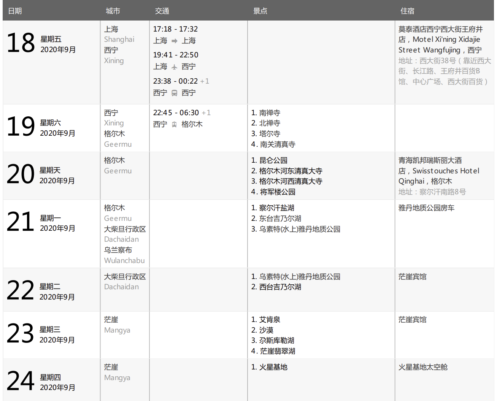

# ING-Blog

# Draft

* **Blog -**  旅行行程的示例

  * 行程单格式参考

    ​​
  * 参考-斯里兰卡行程图：[https://goo.gl/maps/oeVqqT4Eu8QviFxTA](https://goo.gl/maps/oeVqqT4Eu8QviFxTA)  
    ​​

# 中文版

* **Blog - Welcome to China**

  ```python
  您可以通过中华人民共和国文化和旅游部的大众旅游服务栏目查看全国 5A 级景区和国家级旅游度假区，地图可以很直观的看出景点的分布情况。
  在这个页面，可以点击页面中的景区名称，跳转到景区的官网了解详情，部分景区官网支持多国语言。
  网址：https://lyfw.mct.gov.cn/site/special/home
  注意：此页面目前只有中文版，可以尝试浏览器插件做翻译。
  解释：中华人民共和国旅游景区质量等级划分的景区级别，共分为五级，5A 级为中国旅游景区最高等级。

  中华人民共和国与外国互免签证协定清单（英文版）：http://cs.mfa.gov.cn/wgrlh/lhqz/lhqzjjs/201202/t20120207_961630.shtml
  中国签证在线预约：https://avas.mfa.gov.cn/qzyyCoCommonController.do?yyindex&locale=zh_CN


  List of Agreements on Mutual Visa Exemption Between the People’s Republic of China and Foreign Countries: 
  http://cs.mfa.gov.cn/wgrlh/lhqz/lhqzjjs/201202/t20120207_961630.shtml

  IATA - Personalised Passport, Visa & Health travel documentation advice:https://www.iatatravelcentre.com


  无人机禁飞区域查询：https://fly-safe.dji.com/nfz/nfz-query

  物资准备清单：https://user.54traveler.com/user/readylist?rid=153
  货币兑换：如果已经准备好支付软件，无需兑换现金。
  当地通讯：+86
  当地报警电话：110
  运营商：中国电信、中国移动、中国联通

  旅行需要准备的软件：
  支付：支付宝、微信
  打车：滴滴出行
  地图：百度地图、高德地图、腾讯地图
  住宿/机票/高铁票预定：12306、携程旅行 Ctrip、飞猪旅行
  Trip: https://www.trip.com/?locale=en_xx
  12306 CHINA RAILWAY: https://www.12306.cn/en/index.html
  注意：搜索预定酒店的时候增加筛选项：外宾适用
  天气：
  中央气象台台风网：http://typhoon.nmc.cn/web.html

  Payment: 支付宝 Alipay, 微信 WeChat
  Take a taxi: 滴滴出行 Didi Chuxing
  Maps: 百度地图 Baidu Map, 高德地图 AutoNavi Map, 腾讯地图 Tencent Map
  Accommodation/air ticket/high-speed rail ticket reservation: 携程旅行 Ctrip、飞猪旅行 Fliggy Travel
  Note: When searching for a booked hotel, add a filter item: applicable to foreign guests.
  ```

# English version

* **2019-04-26~2019-05-05  斯里兰卡**  
  战争未去成

  * **待办**

    * Vlog脚本
    * 拍摄主题
    * 游记主题/形式
    * 科伦坡酒店住宿
    * 租赁：无人机，水下相机*2

      * 水下相机/11天：TG4老版本，63，TG5 140
      * 无人机/11天：Mavic air 350，Mavic2变焦版 1000，Mavic2 专业版 1200
  * **购物**

    * 中信VISA境外刷卡返现（微信/短信登记）：[https://creditcard.ecitic.com/m/skgl/skyh_visa_details.html?index=0&amp;r=0.9772691711716655&amp;from=singlemessage](https://creditcard.ecitic.com/m/skgl/skyh_visa_details.html?index=0&r=0.9772691711716655&from=singlemessage)
    * 购物清单
    * 购物攻略
    * 给大白等寄明信片
  * **官方资料**

    * 重要联系方式

      * 【外交部全球领保与服务应急呼叫中心电话】：0086-10-12308或0086-10-59913991
      * 中国号码拨打斯里兰卡号码：0094+区号+电话号码
      * 斯里兰卡号码拨打中国号码：0086+电话号码
      * 斯里兰卡全球旅行服务电话：1912
      * 急救电话：108
      * 【报警电话】：119、118（全国）；011-2433333（科伦坡）
      * 【旅游警察（科伦坡）】：011-2421052
      * 【驻斯里兰卡使馆领事保护协助电话】：0094-11-2676033。 【使馆地址】：斯里兰卡科伦坡七区佛光路381A号；381A, Bauddhaloka Mawatha, Colombo 7, Sri Lanka
      * 【中国驻斯里兰卡使馆求助电话】：0094-779288949
    * 斯里兰卡国家铁路网：[http://www.railway.gov.lk](http://www.railway.gov.lk/)
    * 斯里兰卡天气查询：[https://www.tianqi.com/worldcity/1280001.html](https://www.tianqi.com/worldcity/1280001.html)
    * 斯里兰卡旅游局：[http://www.srilanka.travel/](http://www.srilanka.travel/)
    * 日出日落时间：[http://time.123cha.com/](http://time.123cha.com/)
    * 月相查询：[http://rasnz.org.nz/in-the-sky/lunar-phases](http://rasnz.org.nz/in-the-sky/lunar-phases)
  * **行前准备**

    * **攻略：**

      * 微笑的力量——2017斯里兰卡九日游（含乌达瓦拉维国家公园及酒店住宿包车详细攻略）：[https://imfw.cn/l/31460580](https://imfw.cn/l/31460580)
      * 景点

        * 斯里兰卡景点分布：[http://www.mafengwo.cn/baike/11058_1132.html](http://www.mafengwo.cn/baike/11058_1132.html)
        * 斯里兰卡十个国家公园推荐，感受“动植物天堂”的魅力：[https://www.mafengwo.cn/gonglve/ziyouxing/153061.html](https://www.mafengwo.cn/gonglve/ziyouxing/153061.html)
        * 斯里兰卡国家公园哪个值得去？实用干货看这里：[https://www.mafengwo.cn/gonglve/ziyouxing/198382.html](https://www.mafengwo.cn/gonglve/ziyouxing/198382.html)
        * 亭可马里攻略：[https://www.jianshu.com/p/21ed1be73e0d](https://www.jianshu.com/p/21ed1be73e0d)
        * 努沃勒埃利耶（NUWARA ELIYA）小英格兰茶园小镇：[http://www.mafengwo.cn/gonglve/ziyouxing/158113.html](http://www.mafengwo.cn/gonglve/ziyouxing/158113.html)
      * 活动

        * **慢行绿色世界：斯里兰卡有什么徒步线路？：**​[http://www.mafengwo.cn/gonglve/ziyouxing/80074.html](http://www.mafengwo.cn/gonglve/ziyouxing/80074.html)
        * 霍顿平原国家公园 Horton Plains National Park 徒步

          * 建议游客在5：30~6：00从挪日利亚或者是哈普塔勒出发，在7：00左右到达世界尽头，会看到较为壮观的景色。重要提示：世界尽头没有安全护栏，所以一定要留心悬崖边上的岩壁。
        * 斯里兰卡（动物、潜水、SPA）：[http://www.mafengwo.cn/baike/11058_1135.html](http://www.mafengwo.cn/baike/11058_1135.html)
        * 去斯里兰卡学个冲浪吧 - 初学者指南：[https://you.ctrip.com/travels/srilanka100084/3584604.html](https://you.ctrip.com/travels/srilanka100084/3584604.html)
        * 亭可马里潜水

          * 5～10月：亭可马里适合潜水，Suwami Rock 可以在水底看佛像，Navy Island可浅尝洞潜，5米长！还有其他多个潜水点！鸽子岛也可以潜水喔，但很贵！推荐Trinco bay dive center 有中文教练
          * 11月～次年4月：南部适合潜水，包括尼甘布、黑卡杜瓦、乌纳瓦图那、威力伽马、美瑞莎等等
          * 潜水店：

            * [https://www.scubadivingweligama.com](https://www.scubadivingweligama.com/)
            * http://www.srilanka-divingtours.com/
            * http://www.trincomaleedivingcentre.com/
            * http://www.divingsrilanka.com/poseidon-diving-centres/trincomalee-diving-centre/
            * [http://theinternationaldivingschool.com/pricing/](http://theinternationaldivingschool.com/pricing/)
      * 住宿

        * 印象中简朴落后的斯里兰卡，却有着5家顶级的奢华酒店：[http://www.mafengwo.cn/gonglve/ziyouxing/92510.html](http://www.mafengwo.cn/gonglve/ziyouxing/92510.html)
        * 走起：有一种酒店，叫做遗产酒店！：[https://www.sohu.com/a/158239703_99932381](https://www.sohu.com/a/158239703_99932381)
        * 亭可马里玩住哪里好：[http://www.mafengwo.cn/wenda/detail-13561083.html](http://www.mafengwo.cn/wenda/detail-13561083.html)
        * 斯里兰卡有哪些极具特色的酒店？：[https://www.mafengwo.cn/gonglve/ziyouxing/44317.html](https://www.mafengwo.cn/gonglve/ziyouxing/44317.html)
    * **机票/包车：**

      * 注意：转机去其他国家，有可能因为政策不同，导致部分液体、药物等不能登机
      * 中信航空意外险/延误险（中信信用卡指定渠道购票）：[https://creditcard.ecitic.com/yongka/quanyi.shtml](https://creditcard.ecitic.com/yongka/quanyi.shtml)
      * 包车费用：410美金，定金：CNY 400/4人，余下350美金付给司机（或者卢比）  
        中国客服电话：18943755258

        报价已经包含：  
        1.司机三餐  
        2.司机住宿  
        3.车辆油费  
        4.过路过桥费  
        5.另外赠送出国乘车乘客险，详情见保单  
        仅不包括小费，**小费一天7-10美元或1200卢比**（相当于40多元人民币）

        按照您的行程自由行可以的亲
    * **斯里兰卡签证：**

      * 斯里兰卡采用电子签证，前往斯里兰卡旅游必须持有ETA（Electronic Travel Authorization，即电子旅行授权），ETA的有效期间为六个月。获得ETA游客将在入境港得到30天游览斯里兰卡的签证。ETA申请官网：[www.eta.gov.lk](http://www.eta.gov.lk/)
      * 打印出来和往返机票电子行程单一起使用直接出关
      * 填写步骤：[http://www.mafengwo.cn/travel-news/631323.html](http://www.mafengwo.cn/travel-news/631323.html)
    * **保险：**

      * 中国太平洋财产保险股份有限公司 - 出行保亚洲畅行 CNY 41.2/人
      * 保单号：王超：：NO.AHAZ01WE0619Z319475D；李伟荣：NO.AHAZ01WE0619Z319475E；许乔丽：NO.AHAZ01WE0619Z319475F
      * 客服报险热线：95500-1-3
      * 24小时救援电话（医疗救援）：86-400-650-9178,86-10-64629179
    * **物资准备**

      * 稻草人物资准备：[https://u.54traveler.com/user/readylist?rid=288&amp;uid=0](https://u.54traveler.com/user/readylist?rid=288&uid=0)
      * 车载充电器 - 李伟荣
      * 电话卡：CNY 44.9

        * 套餐：04.26-05.05共10日4G流量，15分钟中国通话，40分钟斯里兰卡通话
      * 转换插头/插线板
      * 电蚊香/防蚊液/风油精
      * Dji Mavic air：CNY 350/11天/4人
      * Olympus TG4：CNY 66*2/12天/4人
    * **Background Knowledge**

      * 《魅力斯里兰卡》：[https://movie.douban.com/subject/25985476/](https://movie.douban.com/subject/25985476/)
      * Lonely Planet
      * 斯里兰卡的国民语言是僧伽罗语和泰米尔语，但是由于以前是英国、荷兰等地的殖民地，英语普及率非常高，所以只要会说英语在那边完全OK。
      * 小费：大多数情况不需要给小费，以下两种情况可以给：①包车每日给司机小费，淘宝会有注明约1000-1500RS/Day；②餐厅没有服务费的时候，一般100卢比。
  * **具体行程**

    * 行程参考

      * 看完就出国之斯里兰卡：[http://www.mafengwo.cn/i/5335085.html](http://www.mafengwo.cn/i/5335085.html)
      * 【8Day】锡兰的微笑：[https://tour.54traveler.com/route/Itinerary/?id=167&amp;date=](https://tour.54traveler.com/route/Itinerary/?id=167&date=)  
        尼甘布、狮子岩、丹布勒、康提、哈普塔勒、乌达瓦拉国家公园、坦加勒、加勒、科伦坡
      * 【9Day】锡兰的微笑·升级版：[https://tour.54traveler.com/route/Itinerary/?id=288&amp;date=](https://tour.54traveler.com/route/Itinerary/?id=288&date=)
    * 行程图：[https://goo.gl/maps/oeVqqT4Eu8QviFxTA](https://goo.gl/maps/oeVqqT4Eu8QviFxTA)  
      ​​
    * 尼甘布 Negombo - 锡吉里耶 Sigriya - 亭可马里  Trincomalee - 康提 Kandy - （火车）- 努沃勒埃利亚 Nuwara Eliya - （哈普塔勒 Haputale？） - 乌达瓦拉维国家公园  Udawalawe National Park - （坦加勒 Tangalle？）  -  加勒 Galle -  代希瓦勒-芒特拉维尼亚 Dehiwala-Mount Lavinia -（海边火车） -  科伦坡 Colombo  
      ​​
  * **20190426 上海浦东T1 14:35 - 6h25min - 19:00 科伦坡 / 香港机场T2 15:15 - 19:15 吉隆坡机场M 22:25 - 23:25 班达拉奈克国际机场 - 尼甘布 Negombo**

    * 往返机票费用：东航：CNY 1448+55,000积分
    * 住宿：Villa Taprobane维拉塔普洛班住宿加早餐旅馆 CNY /4（US$ 37.8）  
      11/3, Thalgahawaththa Road, Duwana, Kochchikade, 尼甘布, 11500, 斯里兰卡 -电话: +94771987494  
      早餐需另付，每人每天US$2.50  
      免费取消：2019年4月24日 下午11:59 [尼甘布]前:
  * **20190427 尼甘布 Negombo - 145km，3h24m - 锡吉里耶 Sigriya - 98.8km，1h49m - 亭可马里  Trincomalee**

    * 景点

      * 狮子岩博物馆
      * 狮子岩 Sigriya Rock
    * 住宿：亭可马里西纳蒙特林克布鲁酒店(Trinco Blu by Cinnamon Trincomalee)，CNY 2272/4人  
      Upuvali，  
      T：+94-26-2221 6111
  * **20190428 亭可马里  Trincomalee**

    * 观鲸
    * 鸽子岛 Pigeon island 浮潜
    * 住宿：亭可马里西纳蒙特林克布鲁酒店(Trinco Blu by Cinnamon Trincomalee)
  * **20190429 亭可马里  Trincomalee - 179km，3h59m - 康提 Kandy**

    * 佛牙寺 Kandy temple
    * 康提湖 Kandy lake
    * 住宿：OZO Kandy  CNY 1112/4人  
      酒店地址：No 31, Saranankara Mawatha,  
      T：+94-81-203 0700  
      确认号：77269SB052350
  * **20190430 康提 Kandy  - 08:47 （火车）12:40 - 努沃勒埃利亚 Nuwara Eliya**

    * Kandy（康提） -- Nanu Oya（努瓦勒埃利亚） 【8:47 AM - 12:40 PM】
    * Nanu Oya（努瓦勒埃利亚） -- Haputale （哈普塔勒）【12:45PM - 14:15PM】
    * 景点

      * 从山的风景角度而言，最美的当属lipton chair及努沃周边大大小小不知名的茶山
      * 马克伍兹茶厂 Mackwoods Labookellie Estate （更名叫Labookellie）
      * 粉红邮局 Pink post office
      * 格雷戈里湖 Gregory Lake
      * 住宿：The Hill Club CNY /4（US$ 240）  
        29 Grand Hotel Road , 努沃勒埃利耶, 22000, 斯里兰卡 -电话: +94 52 2 222653  
        免费取消：2019年4月29日2：30前
  * **20190501 努沃勒埃利亚 Nuwara Eliya   - 161km，4h25m - 乌达瓦拉维国家公园  Udawalawe National Park**

    * 乌达瓦拉维国家公园 Udawalawe National Park

      * 门票：4000卢比/人
      * 🚙吉普车：园区只能由专门用于safari的吉普车进入，不能自驾。一般而言，吉普车有7个座位，约为7000卢比/车。可以包车，也可以拼车，可以在蚂蜂窝预定，也可以在当地酒店或公园门口预定。
      * ⏰开放时间：06：00-17:00点停止售票
      * 🏞safari时间：3小时即可
      * 📝Tips：

        * 🎖早出发，不拥挤，也能早些看到动物；下午4-6点光线柔和的时候
        * 🎖园区内没有卫生间也不允许下车，可以少喝点水
        * 🎖可以带望远镜，观看远处的动物
      * 相较于YALA人少体验好
    * 住宿：Sanrik Holiday Bungalow CNY /4（US$ 56）  
      乌达瓦拉维镇 Udawalawe  
      Sanrik Holiday Bungalow, A18, Udawalawa, 达瓦拉维, 70200, 斯里兰卡 -电话: +94 77 330 1373  
      免费取消：2019年4月23日 下午11:59
  * **20190502  乌达瓦拉维镇 Udawalawe - 137km，3h16m - 加勒 Galle - 44.7km，1h11m - Heritance Ahungalla**

    * 景点

      * 加勒古城 Galle Fort
      * 老城门 Fort Entrance
      * 灯塔 Light house
      * 荷兰教堂 Dutch Church
    * 住宿：Heritance Ahungalla CNY 1691.32/4  
      预订编码： 378875836  
      Galle Road, Ahungalla, Bentota, Sri Lanka  
      Ahungalla, Bentota, Sri Lanka
  * **20190503 Heritance Ahungalla - 113km，3h15m- 辛哈拉加热带雨林 Sinharaja Forest Reserve**

    * 辛哈拉加热带雨林 Sinharaja Forest Reserve -原始森林徒步：[http://www.mafengwo.cn/poi/5442830.html](http://www.mafengwo.cn/poi/5442830.html)

      * 向导：2000Rs-2500Rs（必请）
      * 游览方式：徒步约3h，入园要注意防范蚂蟥
    * 住宿辛哈拉加热带雨林 Sinharaja Forest Edge CNY /4（US$ 62.37）  
      Mederipitiya, Deniyaya, 代尼耶耶, 81500, 斯里兰卡 -电话: +94710714444  
      免费取消：2019年5月1日 下午11:59
  * **20190504 辛哈拉加热带雨林 Sinharaja Forest Reserve - 158km，3h49m - 代希瓦勒-芒特拉维尼亚 Dehiwala-Mount Lavinia（海边火车） -  科伦坡 Colombo**

    * 海边火车（稻草人说明）：因为海边小火车没有一等车厢（唯一有空调的等级），所以不接受提前预定，我们只能当天现场购票，优先购买二等座和三等座，但有可能只买到站票。不过火车时间仅45分钟左右，为的就是体验海边小火车风景的精华段。随后，我们将由大巴从中途的火车站接去加勒的海边度假酒店。
    * 加勒附近Koggala海滩高跷渔夫
    * 住宿科伦坡
  * **20190505 科伦坡 20:30 - 20190506 7h35m - 上海浦东T1 06:05 / 班达拉奈克国际机场 00:25 - 06:45 吉隆坡机场M 10:00 - 14:15 香港机场T2**

    * 科伦坡独立广场 Independence Square
    * 独立纪念厅 Independence hall
    * 加勒菲斯绿地广场 Galle Face Green
    * 科伦坡Odel购物中心 Odel Department Store
    * 红色清真寺 Red Mosque
