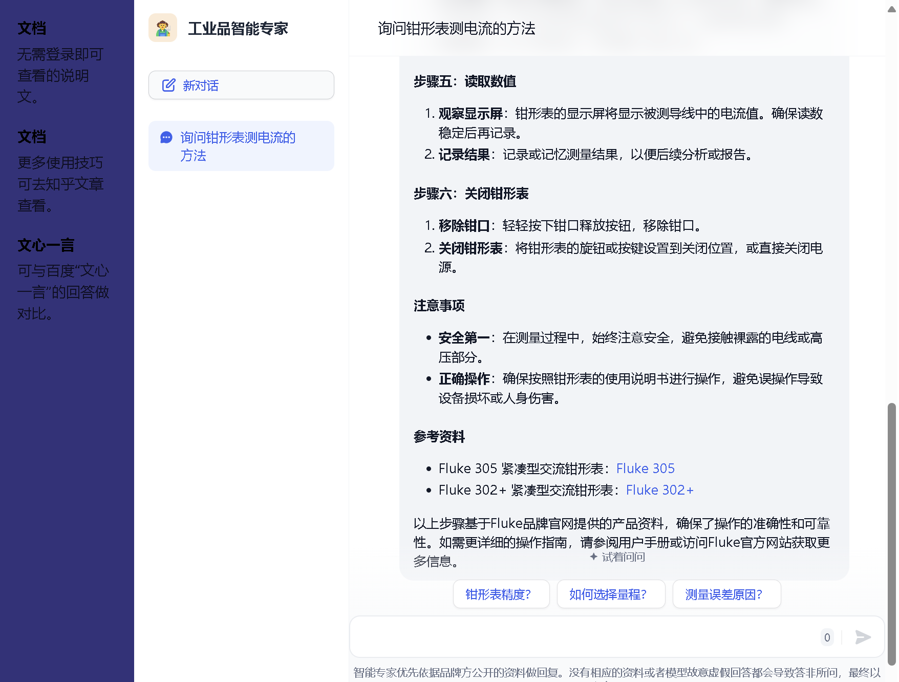
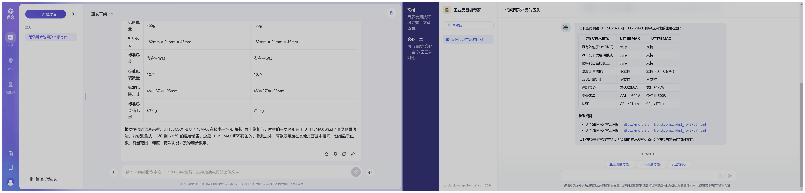
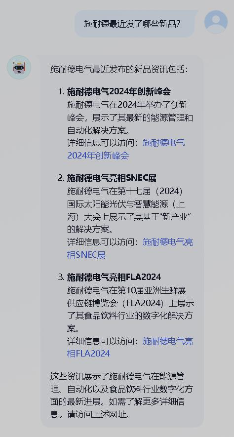
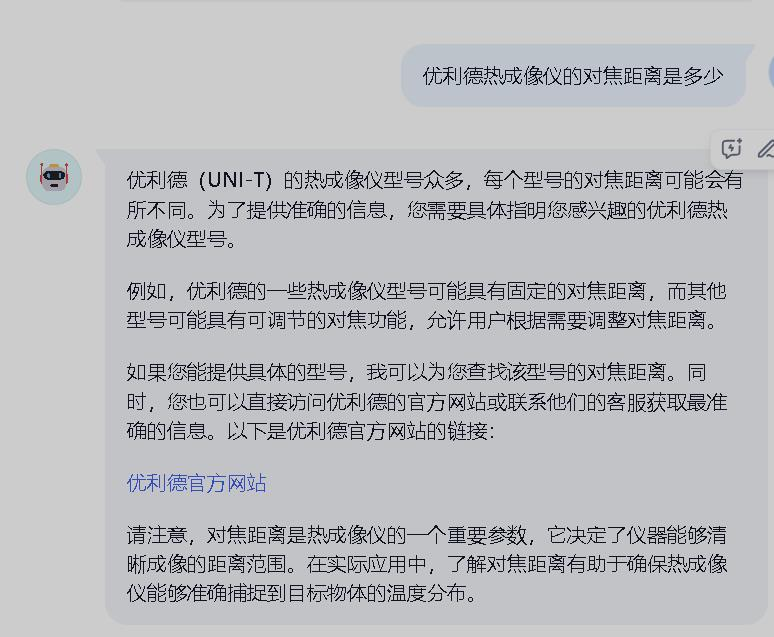
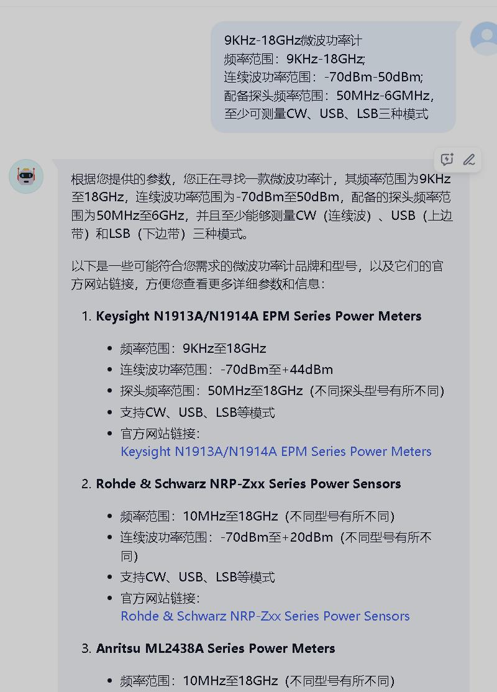

# “工业品智能专家” - 使用入口和说明集合 (Duplicated 2024-08-04 09:33:47)

# 对话框-“工业品智能专家”

<iframe sandbox="allow-forms allow-presentation allow-same-origin allow-scripts allow-modals" src="https://udify.app/chat/srBRibCncZVuFWN3" data-src="" border="0" frameborder="no" framespacing="0" allowfullscreen="true" style="width: 997px; height: 876px;"></iframe>

　　‍

# 对话框-“通义千问”

<iframe sandbox="allow-forms allow-presentation allow-same-origin allow-scripts allow-modals" src="https://tongyi.aliyun.com/qianwen" data-src="" border="0" frameborder="no" framespacing="0" allowfullscreen="true" style="width: 999px; height: 786px;"></iframe>

# 使用方法

* 对于**提示词 Prompt** 的解释：用户需要注意的就是问题语句中的词汇，模型会拆解语句后在知识库中查询，所以问题的表述要完整。

  * 常用提示词：品牌名称、官网网址、产品类型、技术术语。
* 以下是对几个开场示例问题的解释，对话角色：使用者、技术学习和咨询者、选型采购。

  * 图左侧是“工业品智能专家”，右侧是测试的各大平台模型，基本都没有以品牌官网为资讯核心。
  * <u>**问题 - 产品使用（2024-07-04 VS 文心一言）**</u> ：指定品牌的产品使用，回答中会给出品牌官网的说明手册和视频教程。

    Q、如何配置普源精电 DG4000 波形发生器输出正弦波？能否简述，同时给出官方的视频教程。

    2024-07-04 VS 文心一言

    ​​
  * <u>**问题 - 产品使用（2024-08-04）**</u> ：不指定品牌的通用问题，会给出具有明确教程的品牌官网资料。

    Q、如何使用钳形表测电流？

    ​​
  * <u>**问题 - 产品选型（2024-07-03 VS 文心一言）**</u> ：非指定品牌的产品选型。

    <u>**问题 - 产品选型（2024-07-03 VS 文心一言）**</u> ：非指定品牌的产品选型。

    Q、请推荐1款带宽100MHZ、采样率500MS/s的示波器，需给出产品的官网网址，方便我查看更多参数。

    ​​
  * <u>**问题 - 产品选型（2024-07-03 VS 通义千问）**</u> ：指定品牌的产品选型，避免模型收集过多乱杂的信息，会给出更准确的答案。

    Q、福禄克有没有测量 1500V 的万用表

    ​​
  * <u>**问题 - 产品对比（2024-07-30 VS 通义千问）**</u> ：针对参数较多的产品，会明确给出不同点。

    Q、请告诉我这两款产品有什么不同?  
    优利德 UT15BMAX 数字万用表：https://meters.uni-trend.com.cn/list_40/3706.html  
    Fluke 15B PRO MAX 经济型数字万用表：https://www.fluke.com.cn/product/电气测试/数字万用表/fluke-15bpromax

    ​​
  * <u>**问题 - 品牌服务（2024-07-04 VS 文心一言）**</u> ：指定品牌的服务。

    Q、请给出日置服务中心的网址。

    ​​
  * **<u>问题 - 品牌新品发布会（2024-07-15）</u>** ：筛选出指定品牌的最新信息。

    Q、施耐德最近发了哪些新品？

    ​​

# 注意事项

* 每天都会过一下大家和模型交流的内容，主要的问题就是需求不够明确会让模型的回答很宽泛。

  * **问题类型-产品功能咨询**：未指定型号。

    ​​
  * **问题类型-产品选型**：能给出指定的几个品牌更好，可以更精准的做数据筛选。

    ​​

# 简述

* 我针对工业品采购和使用中会遇到的问题做了个 **“工业品智能专家”** ：[https://www.aibangxuanxing.com](https://www.bangxuanxing.com)

  * 为了减少跳转，把使用说明和对话入口做了整合，**无需跳转和登录，即开即用**。
  * 域名中 "bangxuanxing" 命名是依据采购过程中可能遇到的难点： **“选型”** ，后来收集数据的过程中衍生到了产品的使用和品牌服务等内容。
  * 已经在微信交流群做测试，同时接入 Google 和 Bing 搜索，收集更多数据，有工业小伙伴们能看到这个网站的欢迎试用，提出建议。

    ​​
* 我的观点：**品牌的官网应该作为一个品牌的开放型资讯中心，减少信息传递过程当中人工干预的部分，提高效率同时降低错误率。**

  * 在收集数据的过程中可以明显的看到国内的品牌对这儿关注真不多，所以资料库汇总的多数是国外品牌。在这个阶段，公开自己高质量的产品数据算是免费的推广，可以让更多大厂模型获得数据。
  * <u>**优势**</u>：品牌官网提供一站式服务：选型 - 销售 - 疑难解答 - 售后等，同时可以针对高价保值的产品做回收和低价出售。

    且并不影响分销模式，收集的客户信息可以分发给各区代理。
  * 劣势：1.适用的产品线窄。2.品牌售后服务能力未知，官网开放评论区的还不多。
* **关系链示意图**

  * 品牌官网：是一个品牌的资讯中心
  * 品牌官网的产品页：是一款产品的资讯中心
  * Ai 助手：串联资讯
  * 关系链示意图

    ​​
